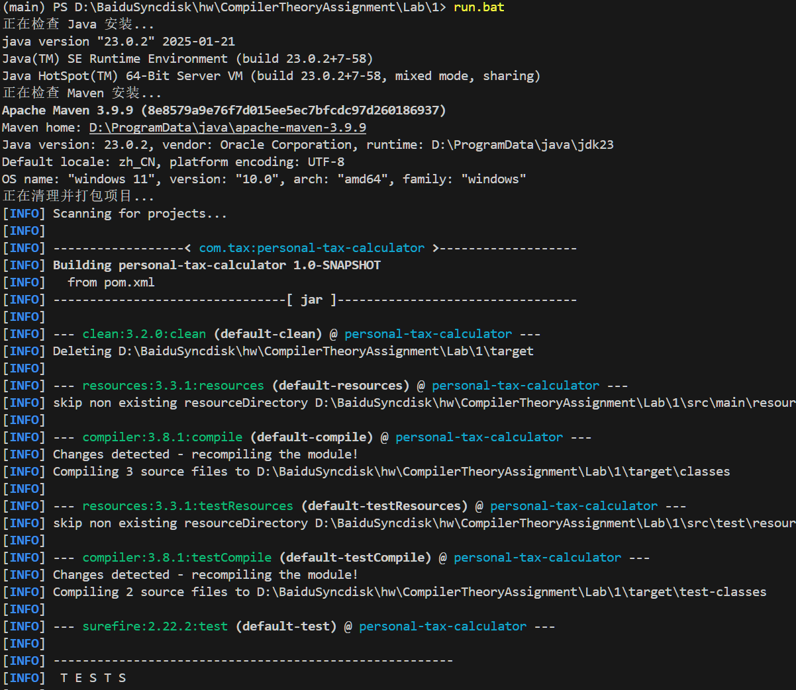
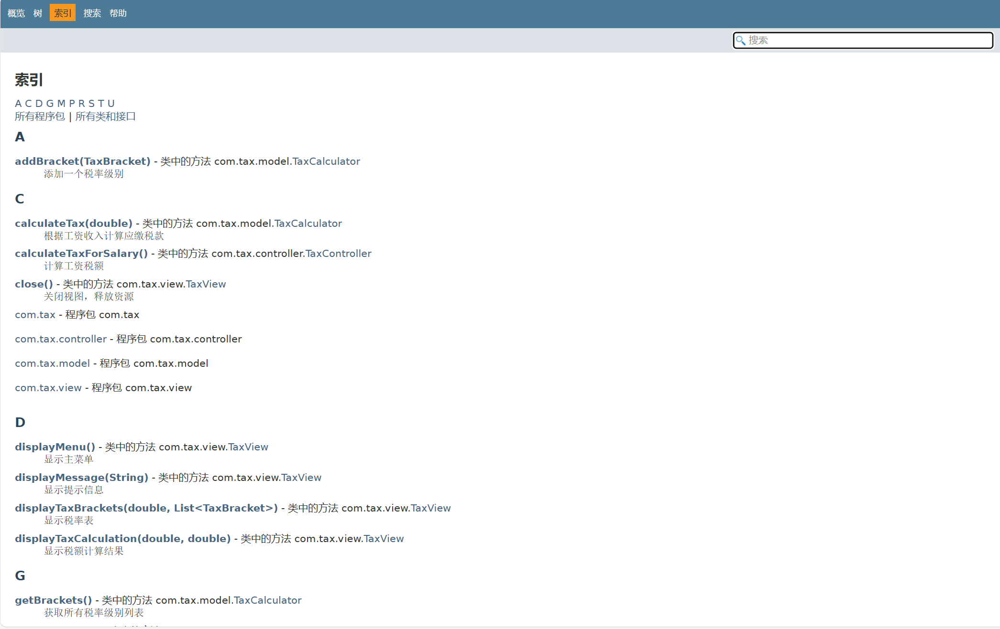
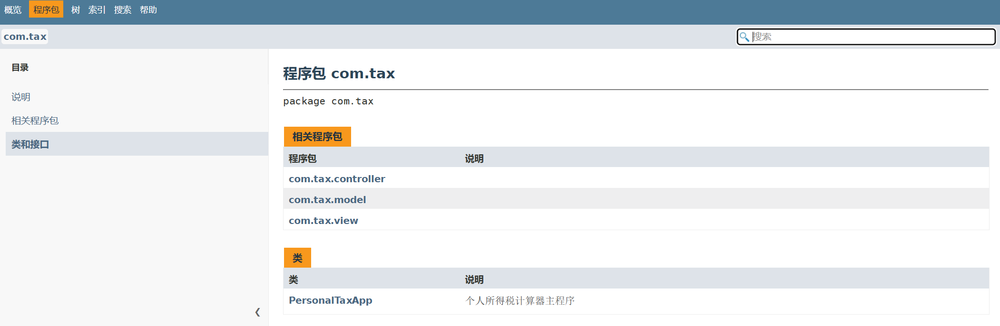

# 个人所得税计算器


## 作者信息

- **姓名**：胡瑞康
- **学号**：22336087
- **邮箱**：hurk3@mail2.sysu.edu.cn
- **电话**: 13265249840

## 项目简介

个人所得税计算器是一款基于命令行界面的 Java 应用程序，旨在帮助用户根据工资收入及预设的级进税率表计算应缴纳的个人所得税。该项目不仅支持固定的税率级别，还允许用户自定义起征点和税率区间，以适应未来可能的税法变化。


## 功能特性

- **级进税率计算**：根据税率区间（TaxBracket）实现阶梯式税率计算，确保税款计算的准确性和灵活性。
- **自定义设置**：
  - 支持动态调整起征点（TaxCalculator.threshold），适应不同地区的税收政策。
  - 允许用户修改税率区间（TaxBracket），包括上下限和税率值，满足未来税法变化的需求。
- **交互式命令行界面**：
  - 提供简洁的菜单系统，用户可以通过输入数字选择操作。
  - 支持输入工资、查看当前税率表、修改税率级别等功能，操作直观易用。
- **实时计算与反馈**：
  - 输入工资后可即时显示应缴税额及税后收入，计算结果精确到小数点后两位。
  - 提供详细的税率表展示，帮助用户理解税款计算过程。
- **输入验证与错误处理**：
  - 对用户输入进行严格验证，确保输入格式正确。
  - 提供友好的错误提示，避免程序因非法输入而崩溃。
- **单元测试支持**：
  - 使用 JUnit 5 完成了 TaxCalculator 和 TaxBracket 的单元测试，确保核心逻辑的正确性与健壮性。
  - 通过 Mockito 模拟用户输入，测试控制层的交互逻辑。
- **扩展性与维护性**：
  - 采用 MVC 架构设计，实现高内聚低耦合，便于未来功能扩展和维护。
  - 通过依赖注入支持单元测试，提升代码的可测试性。

## 技术栈

- **Java**: 版本 23.0.2
- **Maven**: 项目构建与依赖管理工具
- **JUnit 5**: 单元测试框架

## 编译与运行

### 环境准备

1. 确保已安装 JDK 23.0.2 以及 Maven。
2. 将项目代码克隆或下载到本地。

### 编译项目

进入项目根目录，执行以下命令编译并打包项目：

```bash
mvn clean package
```

### 运行项目

打包完成后，执行以下命令启动应用程序：

```bash
java -jar target/personal-tax-calculator-1.0-SNAPSHOT.jar
```

运行后将显示交互式菜单，按提示进行操作即可。


### 一键运行脚本

为了方便一键运行，可以使用run.bat脚本启动
```bash
./run.bat
```


### 运行测试

使用 Maven 运行测试用例，执行：

```bash
mvn test
```


### JavaDoc 生成

运行
```shell
javadoc -d docs -sourcepath src/main/java -subpackages com.tax
```
即可在docs文件夹下生成JavaDoc文档，运行LiveServer插件即可打开网页查看。






## 收获体会

通过本次个人所得税计算器的开发，我对 MVC 架构 和 Java 编程 有了更深刻的理解和体会。

MVC（Model-View-Controller）是一种经典的设计模式，通过将应用程序分为模型层、视图层和控制层，实现了职责分离和代码复用。

在本次项目中，我体会到了 MVC 架构的以下优势：

- 职责清晰：

    模型层（Model）：负责核心业务逻辑（如税款计算）和数据管理（如税率区间）。通过封装税率区间和计算逻辑，模型层具有高度的独立性和可复用性。

    视图层（View）：负责与用户的交互，包括输入捕获和结果展示。视图层的设计使得用户界面与业务逻辑完全分离，便于未来更换界面（如从命令行切换到图形界面）。

    控制层（Controller）：作为模型和视图的桥梁，负责协调用户请求和业务逻辑。控制层的设计使得业务流程更加清晰，便于扩展和维护。

- 高内聚低耦合：

    通过分层设计，各层之间的依赖关系更加清晰，降低了模块之间的耦合度。

    例如，税率计算逻辑（模型层）与用户界面（视图层）完全分离，修改税率计算逻辑不会影响用户界面的实现。

- 易于测试：

    由于各层职责明确，单元测试可以针对每一层单独进行。例如，模型层的 TaxCalculator 可以通过 JUnit 测试其计算逻辑，而视图层可以通过 Mockito 模拟用户输入进行测试。

    依赖注入的设计使得控制层的测试更加灵活，可以通过注入模拟对象来测试控制逻辑。

本次项目也是我第一次编写较大的 Java 程序，此前只在打CTF比赛时遇到 Java Web 的题目时专门查过很多资料。下面是我对 Java 编程的体会：

- 面向对象编程的优势：

    Java 是一门纯粹的面向对象语言，通过类、对象、继承、封装等特性，能够很好地实现代码的模块化和复用。

    例如，TaxBracket 类封装了税率区间的上下限和税率，并通过 toString() 方法提供了格式化输出功能，体现了封装的思想。

- 类型安全与健壮性：

    Java 的强类型特性使得代码更加健壮，能够在编译期发现许多潜在的错误。

    例如，在税款计算过程中，通过 double 类型确保数值计算的精确性，并通过异常处理机制（如 NumberFormatException）避免非法输入导致的程序崩溃。

- 工具链的完善：

    Java 生态提供了丰富的工具链支持，如 Maven 用于项目构建和依赖管理，JUnit 用于单元测试，Mockito 用于模拟对象测试。

    这些工具极大地提升了开发效率和代码质量。
