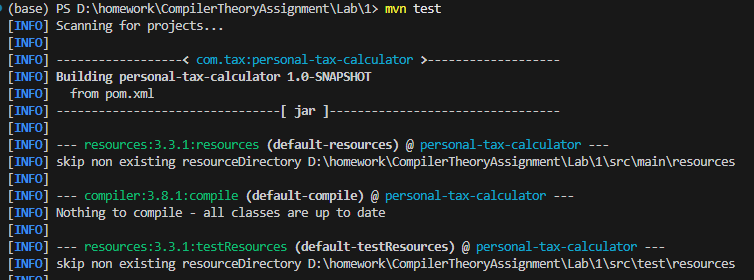
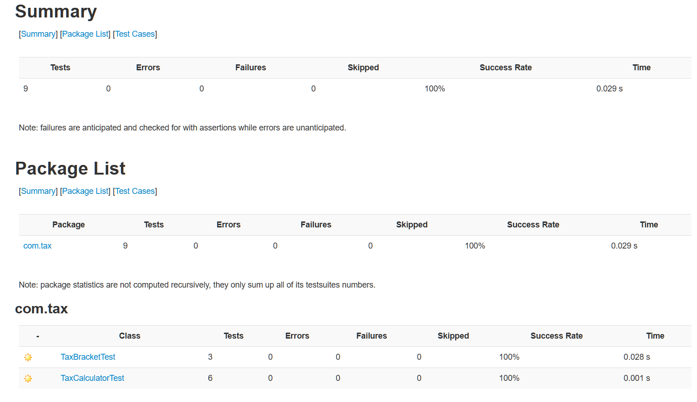

# 个人所得税计算器

## 项目简介

个人所得税计算器是一款基于命令行界面的 Java 应用程序，旨在帮助用户根据工资收入及预设的级进税率表计算应缴纳的个人所得税。该项目不仅支持固定的税率级别，还允许用户自定义起征点和税率区间，以适应未来可能的税法变化。

## 个人信息

- **姓名**：胡瑞康
- **学号**：22336087

## 功能特性

- **级进税率计算**：根据税率区间（TaxBracket）实现阶梯式税率计算。
- **自定义设置**：支持调整起征点（TaxCalculator.threshold）和修改各税率级别。
- **交互式命令行界面**：通过简单的菜单系统，用户可以输入工资、查看当前税率表、修改税率级别等。
- **实时计算与反馈**：输入工资后可即时显示应缴税额及税后收入。
- **单元测试支持**：使用 JUnit 5 完成了 TaxCalculator 和 TaxBracket 的单元测试，确保程序的正确性与健壮性。

## 技术栈

- **Java**: 版本 23.0.2
- **Maven**: 项目构建与依赖管理工具
- **JUnit 5**: 单元测试框架

## 项目结构

```bash
personal-tax-calculator/
├── src/
│   ├── main/
│   │   └── java/
│   │       └── com/
│   │           └── tax/
│   │               ├── PersonalTaxApp.java    # 主应用程序入口
│   │               ├── TaxCalculator.java     # 税率计算器逻辑
│   │               └── TaxBracket.java        # 税率区间实体类
│   └── test/
│       └── java/
│           └── com/
│               └── tax/
│                   ├── TaxCalculatorTest.java # TaxCalculator单元测试
│                   └── TaxBracketTest.java    # TaxBracket单元测试
├── pom.xml                                    # Maven配置文件
└── README.md                                  # 项目说明文档
```

## 编译与运行

### 环境准备

1. 确保已安装 JDK 23.0.2 以及 Maven。
2. 将项目代码克隆或下载到本地。

### 编译项目

进入项目根目录，执行以下命令编译并打包项目：

```bash
mvn clean package
```

### 运行项目

打包完成后，执行以下命令启动应用程序：

```bash
java -jar target/personal-tax-calculator-1.0-SNAPSHOT.jar
```

运行后将显示交互式菜单，按提示进行操作即可。


## 测试说明

项目中包含完整的单元测试，测试覆盖以下功能：

- 工资低于起征点时不缴税
- 各税率级别税额的计算正确性
- 跨级别税率计算（如多个税率区间累加计算）
- 高收入情形下各级税率计算验证
- 修改起征点及税率区间后计算结果的正确性

### 运行测试

使用 Maven 运行测试用例，执行：

```bash
mvn test
```

测试运行结束后，可生成测试报告：

```bash
mvn surefire-report:report
```

生成的测试报告存放在 `./target/reports/surefire.html` 中。




## 收获体会

通过本实验，我加深了对 Java 面向对象编程的理解，体会到良好设计与编码规范的重要性。

同时，在实际编程过程中学习了如何使用 JUnit 进行单元测试，并掌握了 Maven 的基本使用方法，对构建和管理 Java 项目有了更深入的认识。