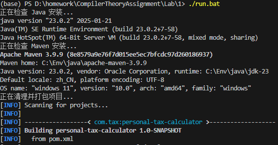

# 个人所得税计算器


## 个人信息

- **姓名**：胡瑞康
- **学号**：22336087
- **邮箱**：hurk3@mail2.sysu.edu.cn
- **电话**: 13265249840

## 项目简介

个人所得税计算器是一款基于命令行界面的 Java 应用程序，旨在帮助用户根据工资收入及预设的级进税率表计算应缴纳的个人所得税。该项目不仅支持固定的税率级别，还允许用户自定义起征点和税率区间，以适应未来可能的税法变化。


## 功能特性

- **级进税率计算**：根据税率区间（TaxBracket）实现阶梯式税率计算。
- **自定义设置**：支持调整起征点（TaxCalculator.threshold）和修改各税率级别。
- **交互式命令行界面**：通过简单的菜单系统，用户可以输入工资、查看当前税率表、修改税率级别等。
- **实时计算与反馈**：输入工资后可即时显示应缴税额及税后收入。
- **单元测试支持**：使用 JUnit 5 完成了 TaxCalculator 和 TaxBracket 的单元测试，确保程序的正确性与健壮性。

## 技术栈

- **Java**: 版本 23.0.2
- **Maven**: 项目构建与依赖管理工具
- **JUnit 5**: 单元测试框架

## 编译与运行

### 环境准备

1. 确保已安装 JDK 23.0.2 以及 Maven。
2. 将项目代码克隆或下载到本地。

### 编译项目

进入项目根目录，执行以下命令编译并打包项目：

```bash
mvn clean package
```

### 运行项目

打包完成后，执行以下命令启动应用程序：

```bash
java -jar target/personal-tax-calculator-1.0-SNAPSHOT.jar
```

运行后将显示交互式菜单，按提示进行操作即可。



### 一键运行脚本

为了方便一键运行，可以使用run.bat脚本启动
```bash
run.bat
```


## 测试说明

项目中包含对模型和控制器的单元测试，具体如下：

### **`TaxBracketTest`**
#### 功能：
- 测试 `TaxBracket` 类的 `toString()` 方法是否正确生成税率区间的字符串表示。
- 验证有限和无限上限的税率区间格式化是否符合预期。

#### 覆盖点：
- **有限上限**：测试普通税率区间 `[500, 2000]` 的字符串表示。
- **无限上限**：测试无限上限（`Double.MAX_VALUE`）的税率区间 `[20000, 无上限]` 的字符串表示。

#### 示例测试用例：
```java
@Test
public void testToString_NormalUpperBound() {
    TaxBracket bracket = new TaxBracket(500, 2000, 0.10);
    String expected = "区间 [500.00, 2000.00], 税率 10.0%";
    assertEquals(expected, bracket.toString());
}

@Test
public void testToString_InfiniteUpperBound() {
    TaxBracket bracket = new TaxBracket(20000, Double.MAX_VALUE, 0.25);
    String expected = "区间 [20000.00, 无上限], 税率 25.0%";
    assertEquals(expected, bracket.toString());
}
```

---

### **`TaxCalculatorTest`**
#### 功能：
- 测试 `TaxCalculator` 类的 `calculateTax()` 方法是否正确计算应缴税款。
- 验证工资低于起征点时税款为零的情况。
- 验证多级税率下的税款计算逻辑是否正确。

#### 覆盖点：
- **工资低于起征点**：验证当工资小于或等于起征点时，应缴税款为零。
- **多级税率计算**：验证根据税率级别逐级计算税款的逻辑是否正确。

#### 示例测试用例：
```java
@Test
public void testCalculateTax_NoTaxWhenSalaryBelowThreshold() {
    TaxCalculator calculator = new TaxCalculator(1600);
    calculator.addBracket(new TaxBracket(0, 500, 0.05));
    double salary = 1500;
    double tax = calculator.calculateTax(salary);
    assertEquals(0, tax);
}

@Test
public void testCalculateTax_WithTax() {
    TaxCalculator calculator = new TaxCalculator(1600);
    calculator.addBracket(new TaxBracket(0, 500, 0.05));
    calculator.addBracket(new TaxBracket(500, 2000, 0.10));
    calculator.addBracket(new TaxBracket(2000, 5000, 0.15));
    calculator.addBracket(new TaxBracket(5000, 20000, 0.20));
    calculator.addBracket(new TaxBracket(20000, Double.MAX_VALUE, 0.25));

    double salary = 4000;
    double tax = calculator.calculateTax(salary);
    assertEquals(235, tax, 0.001);
}
```

---

### **`TaxControllerTest`**
#### 功能：
- 测试 `TaxController` 类的 `calculateTaxForSalary()` 方法是否正确调用视图类显示税额计算结果。
- 使用 Mock 对象模拟用户输入和输出行为。

#### 覆盖点：
- **模拟用户输入**：通过 `Mockito` 模拟用户输入工资数据。
- **验证输出**：验证视图类是否正确显示计算结果。

#### 示例测试用例：
```java
@Test
public void testCalculateTaxForSalary() {
    TaxView mockView = mock(TaxView.class);
    when(mockView.getInput()).thenReturn("4000");

    TaxCalculator calculator = new TaxCalculator(1600);
    calculator.addBracket(new TaxBracket(0, 500, 0.05));
    calculator.addBracket(new TaxBracket(500, 2000, 0.10));
    calculator.addBracket(new TaxBracket(2000, 5000, 0.15));
    calculator.addBracket(new TaxBracket(5000, 20000, 0.20));
    calculator.addBracket(new TaxBracket(20000, Double.MAX_VALUE, 0.25));

    TaxController controller = new TaxController(calculator, mockView);
    controller.calculateTaxForSalary();

    verify(mockView, atLeastOnce()).displayTaxCalculation(anyDouble(), eq(4000.0));
}
```


### 运行测试

使用 Maven 运行测试用例，执行：

```bash
mvn test
```


## 收获体会

通过本实验，我加深了对 Java 面向对象编程的理解，体会到良好设计与编码规范的重要性。

同时，在实际编程过程中学习了如何使用 JUnit 进行单元测试，并掌握了 Maven 的基本使用方法，对构建和管理 Java 项目有了更深入的认识。