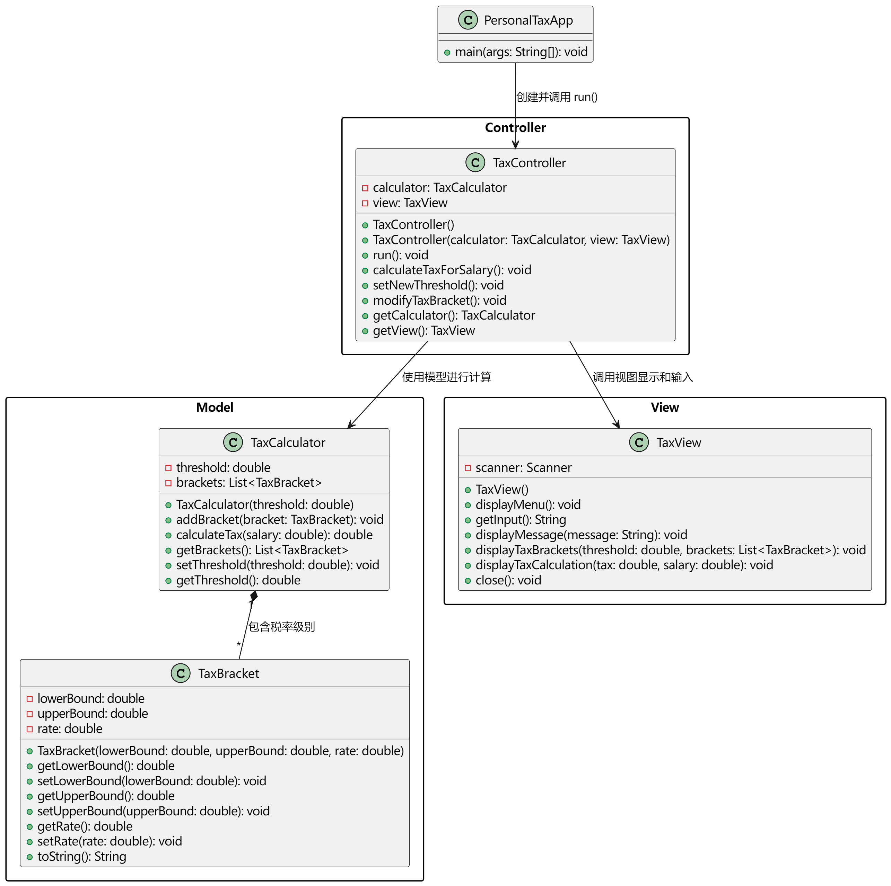

# 个人所得税计算器设计文档

**作者**：胡瑞康
**学号**：2020123456

---

## 项目概述

个人所得税计算器是一款基于命令行界面的 Java 应用程序，旨在帮助用户根据工资收入及预设的级进税率表计算应缴纳的个人所得税。项目支持调整起征点以及修改各税率区间，以便适应未来税法变化，同时采用面向对象设计思想，保证了代码的可维护性和扩展性。

---

## 系统架构

本项目采用分层设计，主要分为以下三个模块：

- **数据实体层**：负责封装税率区间信息，由 `TaxBracket` 类实现。
- **逻辑处理层**：负责管理税率区间及税款计算逻辑，由 `TaxCalculator` 类实现。
- **交互显示层**：负责用户的输入输出及操作控制，由 `PersonalTaxApp` 类实现，提供基于命令行的交互界面。

此外，项目使用 Maven 进行构建和依赖管理，并利用 JUnit 5 完成了单元测试，确保各模块功能正确。

文件组织结构图如下

```bash
personal-tax-calculator/
├── src/
│   ├── main/
│   │   └── java/
│   │       └── com/
│   │           └── tax/
│   │               ├── PersonalTaxApp.java    # 主应用程序入口
│   │               ├── TaxCalculator.java     # 税率计算器逻辑
│   │               └── TaxBracket.java        # 税率区间实体类
│   └── test/
│       └── java/
│           └── com/
│               └── tax/
│                   ├── TaxCalculatorTest.java # TaxCalculator单元测试
│                   └── TaxBracketTest.java    # TaxBracket单元测试
├── pom.xml                                    # Maven配置文件
└── README.md                                  # 项目说明文档
```


UML结构图如下



---

## 类设计

### TaxBracket 类

- **功能**：表示一个税率区间。
- **属性**：
  - `lowerBound`：税率区间的下限；
  - `upperBound`：税率区间的上限（当值为 `Double.MAX_VALUE` 时表示无上限）；
  - `rate`：对应税率（例如 0.05 表示 5%）。
- **主要方法**：
  - 构造器：用于初始化税率区间；
  - Getter/Setter：获取和设置各属性值；
  - `toString()`：格式化输出税率区间信息，支持无上限的特殊显示。

### TaxCalculator 类

- **功能**：管理多个税率区间，按照级进税率计算应缴纳的个人所得税。
- **属性**：
  - `threshold`：税收起征点；
  - `brackets`：存储各级税率区间的列表。
- **主要方法**：
  - `addBracket(TaxBracket bracket)`：添加一个新的税率区间；
  - `calculateTax(double salary)`：根据用户工资和当前税率区间进行累进税款计算；
  - `displayTaxBrackets()`：以表格形式展示当前税率级别及其对应的税率；
  - `setThreshold(double threshold)` 与 `getThreshold()`：修改及获取起征点；
  - `getBrackets()`：获取当前所有税率区间（便于后续修改）。

### PersonalTaxApp 类

- **功能**：作为主程序入口，实现命令行交互，接受用户输入并调用 `TaxCalculator` 进行处理。
- **主要流程**：
  - 程序启动后初始化默认税率计算器和税率区间；
  - 显示主菜单，供用户选择操作：输入工资计算税额、设置起征点、修改税率表、显示当前税率表或退出程序；
  - 根据用户选择，调用对应的静态辅助方法进行处理，如 `calculateTaxForSalary()`、`setNewThreshold()` 和 `modifyTaxBracket()`；
  - 在修改税率表时，进行上下级区间的验证，确保各税率级别的衔接一致性。

---

## 数据流与逻辑流程

1. **用户输入与验证**
   用户通过命令行界面选择操作，并输入相应数据。程序通过捕获 `NumberFormatException` 确保输入格式正确。

2. **税款计算流程**
   - 检查输入工资是否超过起征点；
   - 计算应税收入（工资收入减去起征点）；
   - 遍历每个 `TaxBracket`，按区间逐级累加计算税款（利用 `Math.min` 限制每级的应税额）；
   - 返回最终税款，用户可查看应缴税额及税后收入。

3. **修改税率区间**
   修改时需验证：
   - 当前级别下限必须大于前一级别的上限；
   - 当前级别上限必须等于下一级别的下限（保持税率区间连续无间隙）；
   - 同时更新相邻级别的信息（如自动更新下一级别的下限）。

---

## 用户界面设计

- **命令行菜单**：采用简洁明了的文本菜单，用户通过数字选择操作。
- **输入提示**：每个操作均提供明确的提示信息，如输入工资、设定新起征点及修改税率时的相关校验提示。
- **输出信息**：包括计算结果（税额、税后收入）、当前税率表的格式化输出及修改操作的反馈。

---

## 模块关系与依赖

- **低耦合**：各模块之间职责明确，通过方法调用实现数据传递与逻辑处理。
- **高内聚**：每个类都专注于单一功能：
  - `TaxBracket` 负责单个税率区间的数据封装；
  - `TaxCalculator` 专注于税款计算逻辑；
  - `PersonalTaxApp` 则管理用户交互。
- **扩展性**：未来若需扩展（如添加图形界面或从外部加载税率配置），只需在对应模块中进行调整，不影响整体架构。

---

## 测试设计

- **单元测试**：采用 JUnit 5 对 `TaxCalculator` 和 `TaxBracket` 类进行单元测试，测试内容包括：
  - 工资低于起征点时税款应为 0；
  - 各税率区间计算正确性；
  - 跨级别的累进计算逻辑；
  - 修改起征点及税率后计算结果的准确性；
  - 对 `TaxBracket` 的构造器、getter/setter 以及 `toString()` 方法进行验证。
- **回归测试**：通过 Maven 命令 `mvn test` 可方便地运行所有测试用例，确保修改后不影响既有功能。

---

## 开发环境与工具

- **编程语言**：Java
- **JDK 版本**：23.0.2
- **构建工具**：Maven
- **单元测试**：JUnit 5
- **开发工具**：VS Code