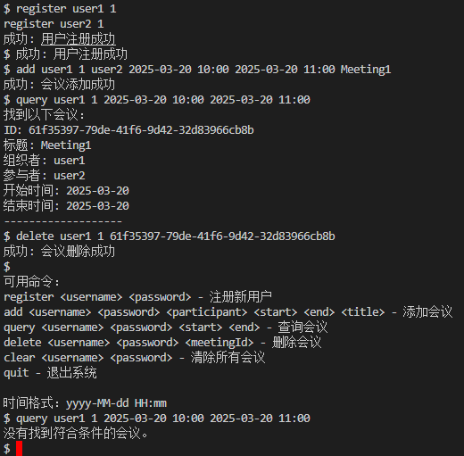
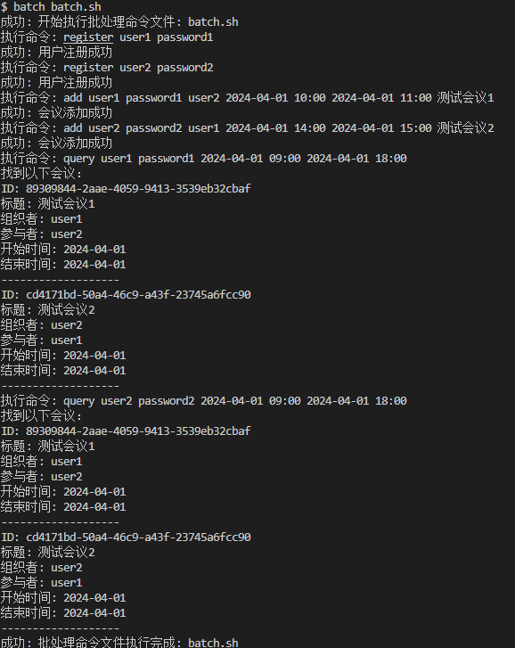
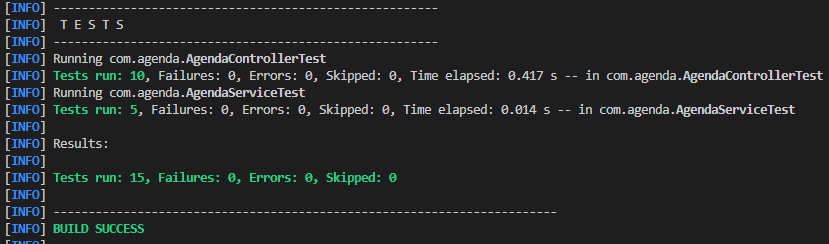
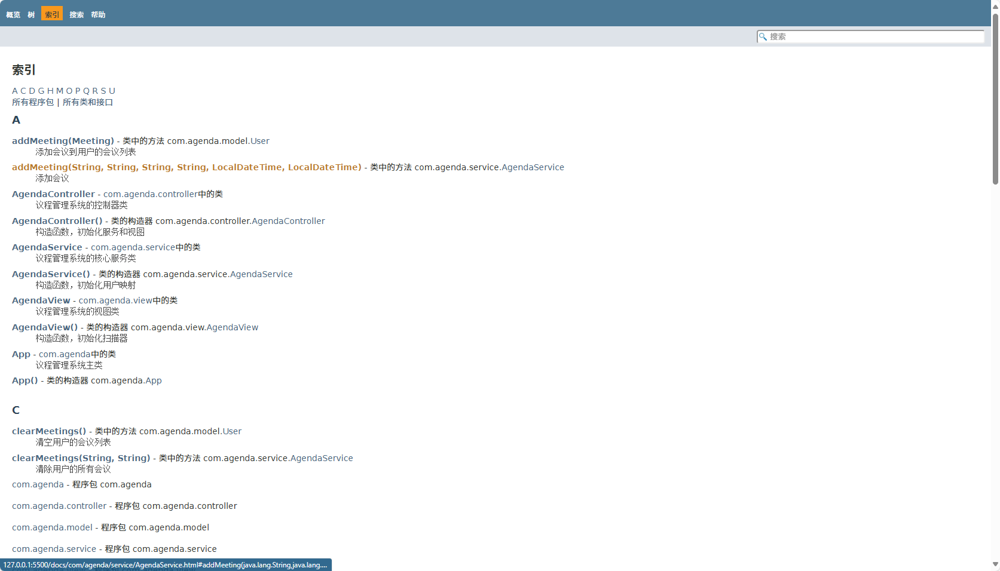

# 运行方法

使用封装好的`run.bat`文件进行编译和运行

```shell
./run.bat
```


# 测试方法

## 人为简单测试

```shell
register user1 1
register user2 1
add user1 1 user2 2025-03-20 10:00 2025-03-20 11:00 Meeting1
query user1 1 2025-03-20 10:00 2025-03-20 11:00
delete user1 1 实际ID
query user1 1 2025-03-20 10:00 2025-03-20 11:00
```

测试结果如图，符合预期，最开始可以查询到，删除会议后查询不到。



## 执行脚本测试

```shell
batch batch.sh
```

成功识别对应脚本并逐行执行



## 自动测试

```shell
mvn test
```

测试结果如图，具体测试内容可参考`design`文件，主要针对Controller和Service层进行测试。



# 文档生成

本次实验代码使用了`javadoc`生成文档，具体命令如下：

```shell
javadoc -d docs -sourcepath src/main/java -subpackages com.agenda
```

执行后会在`docs`目录下生成文档，可使用VsCode的`Live Server`插件打开，具体效果如图


