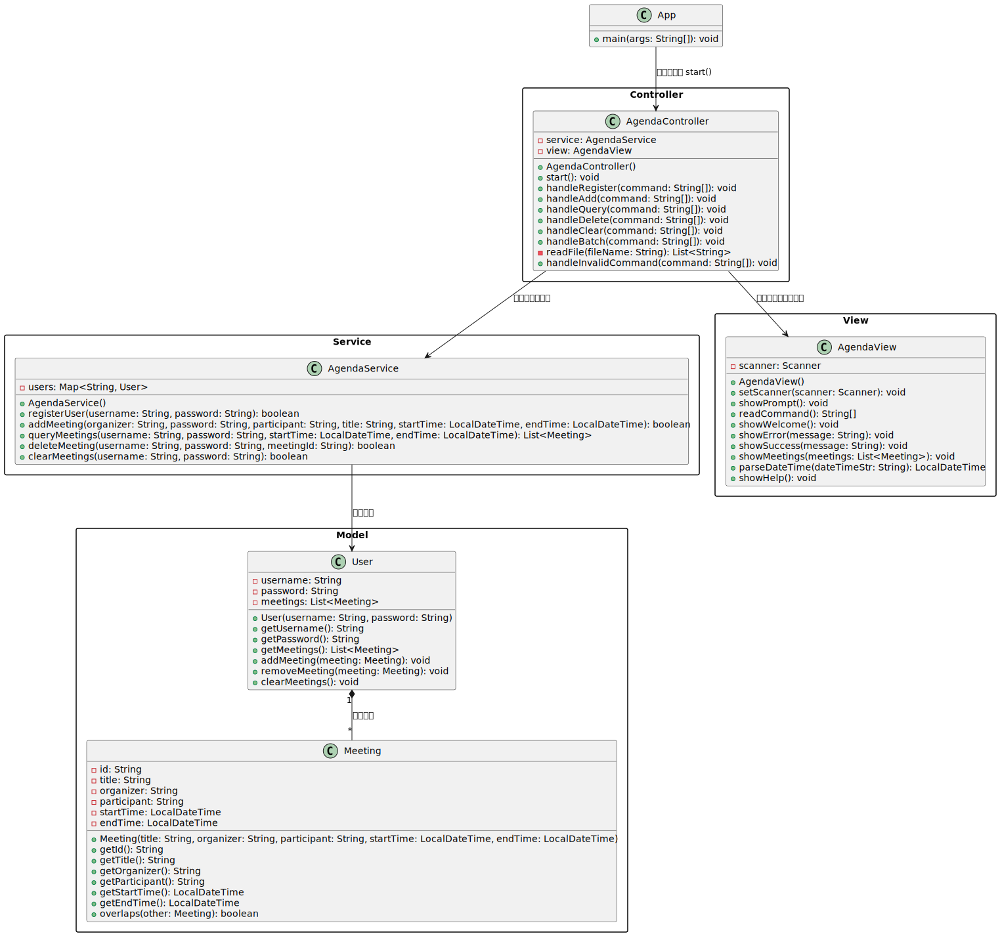

# 议程管理系统设计文档

**作者**：胡瑞康

**学号**：22336087

---

## 项目概述

议程管理系统是一个基于MVC架构的Java命令行应用程序，提供用户注册、会议管理（添加、查询、删除、清空）等功能，确保会议时间无冲突且数据安全可靠。系统采用分层设计，实现高内聚低耦合，便于未来功能扩展和维护。

---

## 文件结构

```bash
src/
├── main/
│   └── java/
│       └── com/agenda/
│           ├── controller/  # 控制器层
│           ├── model/       # 模型层
│           ├── service/     # 服务层
│           ├── view/        # 视图层
│           └── App.java     # 应用入口
└── test/
    └── java/
        └── com/agenda/
            ├── AgendaControllerTest.java  # 控制器测试
            └── AgendaServiceTest.java     # 服务测试
```

---

## 系统架构（MVC模式）

### 分层说明

| 层级             | 组件                  | 职责                       |
| ---------------- | --------------------- | -------------------------- |
| **视图层** | `AgendaView`        | 用户交互界面，输入输出处理 |
| **控制层** | `AgendaController`  | 业务逻辑处理与请求分发     |
| **服务层** | `AgendaService`     | 核心业务逻辑与数据管理     |
| **模型层** | `User`, `Meeting` | 数据实体表示               |

---

### UML类图



---

### 模型层（Model）

#### User 类

**职责**：

- 表示用户数据，封装用户名、密码以及用户的会议列表。
- 提供对会议的增删改查操作，确保会议数据在用户级别的封装与管理。

**关键特性**：

- 封装基本信息（用户名、密码）
- 维护会议集合，便于后续扩展（例如对会议排序、过滤等）

**代码示例**：

```java
public class User {
    private String username;
    private String password;
    private List<Meeting> meetings;

    public User(String username, String password) {
        this.username = username;
        this.password = password;
        this.meetings = new ArrayList<>();
    }

    // 核心方法
    public String getUsername() { return username; }
    public String getPassword() { return password; }
    public List<Meeting> getMeetings() { return meetings; }

    public void addMeeting(Meeting meeting) {
        meetings.add(meeting);
    }

    public void removeMeeting(Meeting meeting) {
        meetings.remove(meeting);
    }

    public void clearMeetings() {
        meetings.clear();
    }
}
```

#### Meeting 类

**职责**：

- 表示会议数据，包含会议ID、标题、组织者、参与者、开始时间与结束时间。
- 提供时间重叠检测，确保会议时间不冲突。

**关键特性**：

- 使用UUID生成唯一标识符
- 检测时间重叠，保障会议调度合理
- 存储会议各项详细信息，便于查询与展示

**代码示例**：

```java
public class Meeting {
    private String id;
    private String title;
    private String organizer;
    private String participant;
    private LocalDateTime startTime;
    private LocalDateTime endTime;

    public Meeting(String title, String organizer, String participant,
                   LocalDateTime startTime, LocalDateTime endTime) {
        this.id = UUID.randomUUID().toString(); // 生成唯一标识符
        this.title = title;
        this.organizer = organizer;
        this.participant = participant;
        this.startTime = startTime;
        this.endTime = endTime;
    }

    // getter 方法...

    /**
     * 判断会议是否与另一个会议时间重叠
     */
    public boolean overlaps(Meeting other) {
        return (this.startTime.isBefore(other.endTime) &&
                this.endTime.isAfter(other.startTime));
    }
}
```

---

### 服务层（Service）

#### AgendaService 类


**职责**：

- 处理用户注册及会议管理的核心业务逻辑。
- 在添加会议时，验证用户合法性、检查密码正确性，并对会议时间冲突进行检测。
- 删除会议时，确保双方（组织者与参与者）的会议记录同步删除。
- 在查询与清空会议时，对非法输入（如错误时间格式、重复添加等）进行合理处理。

**异常处理与边界讨论**：

- **用户注册**：确保用户名唯一，对于重复注册返回失败提示。
- **添加会议**：

  - 对日期时间格式进行严格校验，若格式错误则捕获异常并反馈正确格式提示。
  - 检查组织者和参与者是否存在，若不存在或密码错误则拒绝添加。
  - 对会议时间重叠进行全面检测，避免会议冲突。
- **删除与清空会议**：

  - 在删除会议时，通过会议ID定位目标会议，同时同步删除关联用户记录。
  - 清空会议时，确保删除操作同时反映在所有参与者的会议列表中，防止数据孤岛。

**代码示例**：

```java
public class AgendaService {
    private Map<String, User> users;

    public AgendaService() {
        this.users = new HashMap<>();
    }

    // 用户注册
    public boolean registerUser(String username, String password) {
        if (users.containsKey(username)) {
            return false;
        }
        users.put(username, new User(username, password));
        return true;
    }

    // 添加会议
    public boolean addMeeting(String organizer, String password, String participant,
                             String title, LocalDateTime startTime, LocalDateTime endTime) {
        // 验证用户存在与密码正确
        User organizerUser = users.get(organizer);
        User participantUser = users.get(participant);

        if (organizerUser == null || participantUser == null ||
            !organizerUser.getPassword().equals(password)) {
            return false;
        }

        Meeting meeting = new Meeting(title, organizer, participant, startTime, endTime);

        // 检查时间冲突
        for (Meeting existingMeeting : organizerUser.getMeetings()) {
            if (meeting.overlaps(existingMeeting)) {
                return false;
            }
        }
        for (Meeting existingMeeting : participantUser.getMeetings()) {
            if (meeting.overlaps(existingMeeting)) {
                return false;
            }
        }

        // 添加会议
        organizerUser.addMeeting(meeting);
        participantUser.addMeeting(meeting);
        return true;
    }

    // 查询、删除、清空会议等方法...
}
```

---

### 视图层（View）

#### AgendaView 类

**职责**：

- 提供命令行交互界面，处理用户输入与输出。
- 格式化展示会议列表，并在操作成功或失败时给予用户明确反馈。
- 解析日期时间字符串，严格要求输入格式为 `yyyy-MM-dd HH:mm`，防止非法格式进入后续处理。

**健壮性设计**：

- 对用户输入的命令进行分割、校验，确保参数个数和格式正确。
- 在遇到时间格式错误时，通过异常捕获反馈错误信息，提示用户重新输入正确格式。

**代码示例**：

```java
public class AgendaView {
    private Scanner scanner;
    private static final DateTimeFormatter DATE_FORMATTER =
        DateTimeFormatter.ofPattern("yyyy-MM-dd");
    private static final DateTimeFormatter TIME_FORMATTER =
        DateTimeFormatter.ofPattern("HH:mm");

    public AgendaView() {
        this.scanner = new Scanner(System.in);
    }

    // 交互方法
    public void showPrompt() {
        System.out.print("$ ");
    }

    public String[] readCommand() {
        String line = scanner.nextLine().trim();
        return line.split("\\s+");
    }

    // 显示方法
    public void showWelcome() {
        System.out.println("欢迎使用议程管理系统！");
    }

    public void showError(String message) {
        System.out.println("错误: " + message);
    }

    public void showSuccess(String message) {
        System.out.println("成功: " + message);
    }

    // 格式化显示会议列表
    public void showMeetings(List<Meeting> meetings) {
        if (meetings.isEmpty()) {
            System.out.println("没有找到符合条件的会议。");
            return;
        }

        System.out.println("找到以下会议：");
        for (Meeting meeting : meetings) {
            System.out.printf("ID: %s\n", meeting.getId());
            System.out.printf("标题: %s\n", meeting.getTitle());
            System.out.printf("组织者: %s\n", meeting.getOrganizer());
            System.out.printf("参与者: %s\n", meeting.getParticipant());
            System.out.printf("开始时间: %s\n",
                meeting.getStartTime().format(DATE_FORMATTER));
            System.out.printf("结束时间: %s\n",
                meeting.getEndTime().format(DATE_FORMATTER));
            System.out.println("-------------------");
        }
    }

    // 辅助方法 - 解析时间
    public LocalDateTime parseDateTime(String dateTimeStr) {
        return LocalDateTime.parse(dateTimeStr,
            DateTimeFormatter.ofPattern("yyyy-MM-dd HH:mm"));
    }
}
```

---

### 控制层（Controller）

#### AgendaController 类

**职责**：

- 接收视图层传入的用户命令，解析并调用服务层执行具体业务逻辑。
- 根据返回结果调用视图层显示成功或错误信息。

**功能边界与异常处理**：

- **命令解析**：

  - 根据命令关键字（register、add、query、delete、clear、batch等）进行分发，并校验参数个数。
  - 对不支持或格式错误的命令调用 `handleInvalidCommand` 方法，展示帮助信息。
- **批处理命令**：

  - 通过读取外部文件执行多条命令，文件读取失败时给出明确提示。
  - 在批处理过程中，跳过空行并对每条命令进行格式校验，保证处理过程中的稳定性。
- **异常捕获**：

  - 在调用 `parseDateTime` 等可能抛出异常的方法时，通过 try-catch 捕获异常，并调用视图反馈具体错误（如“时间格式错误，请使用正确的格式：yyyy-MM-dd HH:mm”）。

**代码示例**：

```java
public class AgendaController {
    private AgendaService service;
    private AgendaView view;

    public AgendaController() {
        this.service = new AgendaService();
        this.view = new AgendaView();
    }

    // 主循环
    public void start() {
        view.showWelcome();
        while (true) {
            view.showPrompt();
            String[] command = view.readCommand();

            if (command.length == 0) {
                continue;
            }

            switch (command[0].toLowerCase()) {
                case "register":
                    handleRegister(command);
                    break;
                case "add":
                    handleAdd(command);
                    break;
                case "query":
                    handleQuery(command);
                    break;
                case "delete":
                    handleDelete(command);
                    break;
                case "clear":
                    handleClear(command);
                    break;
                case "batch":
                    handleBatch(command);
                    break;
                case "quit":
                    return;
                default:
                    handleInvalidCommand(command);
            }
        }
    }

    // 命令处理方法示例
    public void handleAdd(String[] command) {
        if (command.length != 7 && command.length != 9) {
            view.showError("添加会议命令格式错误");
            return;
        }

        try {
            String username = command[1];
            String password = command[2];
            String participant = command[3];
            LocalDateTime startDateTime;
            LocalDateTime endDateTime;
            String title;

            // 解析不同格式的命令
            if (command.length == 9) {
                // 处理9个参数格式
                String startDate = command[4];
                String startTime = command[5];
                String endDate = command[6];
                String endTime = command[7];
                title = command[8];

                startDateTime = view.parseDateTime(startDate + " " + startTime);
                endDateTime = view.parseDateTime(endDate + " " + endTime);
            } else {
                // 处理7个参数格式
                startDateTime = view.parseDateTime(command[4]);
                endDateTime = view.parseDateTime(command[5]);
                title = command[6];
            }

            // 调用服务层并显示结果
            if (service.addMeeting(username, password, participant,
                                  title, startDateTime, endDateTime)) {
                view.showSuccess("会议添加成功");
            } else {
                view.showError("会议添加失败，请检查用户名、密码或时间冲突");
            }
        } catch (Exception e) {
            view.showError("时间格式错误，请使用格式：yyyy-MM-dd HH:mm");
        }
    }

    // 批处理命令处理
    public void handleBatch(String[] command) {
        if (command.length != 2) {
            view.showError("批处理命令格式错误");
            return;
        }

        String fileName = command[1];
        List<String> lines = readFile(fileName);

        if (lines == null) {
            return;
        }

        view.showSuccess("开始执行批处理命令文件: " + fileName);

        for (String line : lines) {
            // 跳过空行
            if (line.trim().isEmpty()) {
                continue;
            }

            // 分割命令行
            String[] batchCommand = line.trim().split("\\s+");

            // 显示正在执行的命令
            System.out.println("执行命令: " + line);

            // 处理批处理中的命令，但忽略quit和batch命令
            switch (batchCommand[0].toLowerCase()) {
                case "register":
                    handleRegister(batchCommand);
                    break;
                case "add":
                    handleAdd(batchCommand);
                    break;
                case "query":
                    handleQuery(batchCommand);
                    break;
                case "delete":
                    handleDelete(batchCommand);
                    break;
                case "clear":
                    handleClear(batchCommand);
                    break;
                default:
                    view.showError("不支持的批处理命令: " + batchCommand[0]);
            }
        }

        view.showSuccess("批处理命令文件执行完成: " + fileName);
    }

    // 读取文件内容
    private List<String> readFile(String fileName) {
        try {
            return Files.readAllLines(Paths.get(fileName));
        } catch (IOException e) {
            view.showError("无法读取文件: " + fileName);
            return null;
        }
    }

    // 其他命令处理方法...
}
```

## 主程序入口

**职责**：

- 作为程序入口，实例化 `AgendaController` 并启动系统主循环。
- 保证系统在启动时能正确加载各层组件，进入命令行交互模式。

**示例代码**：

```java
public class App {
    public static void main(String[] args) {
        AgendaController controller = new AgendaController();
        controller.start();
    }
}
```

---

## 测试模块

### AgendaServiceTest 类

**测试目标**：

- 对各功能模块（用户注册、添加会议、查询会议、删除会议、清空会议）进行单元测试。
- 覆盖各种正常情况与边界情况，例如：

  - **合法输入**：确保正确的命令参数能成功完成业务逻辑。
  - **非法输入**：测试非法日期格式、重复注册、会议时间冲突、错误命令格式等场景，验证系统能捕获异常并给出正确反馈。
  - **数据同步**：确保会议的添加、删除及清空操作能在相关用户之间同步更新，保证数据一致性。

通过详细的单元测试，验证系统在各种异常和边界输入下的健壮性，为后续的功能扩展和维护提供保障。

#### 测试用例与代码示例：

- **测试用户注册功能**

```java
@Test
public void testRegisterUser() {
    boolean result = agendaService.registerUser("user1", "pass1");
    assertTrue(result, "第一次注册应成功");

    // 重复注册相同用户名应失败
    result = agendaService.registerUser("user1", "pass2");
    assertFalse(result, "重复注册同一用户名应失败");
}
```

- **测试会议添加成功**

```java
@Test
public void testAddMeetingSuccess() {
    agendaService.registerUser("user1", "pass1");
    agendaService.registerUser("user2", "pass2");

    LocalDateTime startTime = LocalDateTime.of(2025, 3, 21, 10, 0);
    LocalDateTime endTime = LocalDateTime.of(2025, 3, 21, 11, 0);
    boolean addResult = agendaService.addMeeting("user1", "pass1", "user2", "Meeting1", startTime, endTime);
    assertTrue(addResult, "会议添加应成功");
}
```

- **测试会议时间冲突**

```java
@Test
public void testAddMeetingTimeConflict() {
    agendaService.registerUser("user1", "pass1");
    agendaService.registerUser("user2", "pass2");

    LocalDateTime startTime1 = LocalDateTime.of(2025, 3, 21, 10, 0);
    LocalDateTime endTime1 = LocalDateTime.of(2025, 3, 21, 11, 0);
    agendaService.addMeeting("user1", "pass1", "user2", "Meeting1", startTime1, endTime1);

    LocalDateTime startTime2 = LocalDateTime.of(2025, 3, 21, 10, 30);
    LocalDateTime endTime2 = LocalDateTime.of(2025, 3, 21, 11, 30);
    boolean conflictResult = agendaService.addMeeting("user1", "pass1", "user2", "Meeting2", startTime2, endTime2);
    assertFalse(conflictResult, "有时间冲突的会议应添加失败");
}
```

- **测试会议删除**

```java
@Test
public void testDeleteMeeting() {
    agendaService.registerUser("user1", "pass1");
    agendaService.registerUser("user2", "pass2");

    LocalDateTime startTime = LocalDateTime.of(2025, 3, 22, 9, 0);
    LocalDateTime endTime = LocalDateTime.of(2025, 3, 22, 10, 0);
    agendaService.addMeeting("user1", "pass1", "user2", "MeetingToDelete", startTime, endTime);

    List<Meeting> meetings = agendaService.queryMeetings("user1", "pass1", startTime.minusHours(1), endTime.plusHours(1));
    String meetingId = meetings.get(0).getId();

    boolean deleteResult = agendaService.deleteMeeting("user1", "pass1", meetingId);
    assertTrue(deleteResult, "删除会议应成功");
}
```

- **测试清空会议**

```java
@Test
public void testClearMeetings() {
    agendaService.registerUser("user1", "pass1");
    agendaService.registerUser("user2", "pass2");

    LocalDateTime startTime1 = LocalDateTime.of(2025, 3, 23, 14, 0);
    LocalDateTime endTime1 = LocalDateTime.of(2025, 3, 23, 15, 0);
    agendaService.addMeeting("user1", "pass1", "user2", "Meeting1", startTime1, endTime1);

    agendaService.clearMeetings("user1", "pass1");

    List<Meeting> meetings = agendaService.queryMeetings("user1", "pass1", startTime1.minusDays(1), endTime1.plusDays(1));
    assertTrue(meetings.isEmpty(), "所有会议应被清空");
}
```

### AgendaControllerTest 类

**职责**：测试控制层命令解析与分发，使用Mockito模拟service和view交互。

#### 主要测试内容与代码示例：

- **测试用户注册命令**

```java
@Test
void testHandleRegister_Success() {
    String[] command = {"register", "testUser", "password123"};
    when(service.registerUser("testUser", "password123")).thenReturn(true);
    controller.handleRegister(command);
    verify(view).showSuccess("用户注册成功");
}
```

- **测试会议添加成功**

```java
@Test
void testHandleAdd_Success() {
    String[] command = {"add", "testUser", "password123", "participant", "2024-03-20 10:00", "2024-03-20 11:00", "会议标题"};
    LocalDateTime start = LocalDateTime.of(2024, 3, 20, 10, 0);
    LocalDateTime end = LocalDateTime.of(2024, 3, 20, 11, 0);

    when(view.parseDateTime("2024-03-20 10:00")).thenReturn(start);
    when(view.parseDateTime("2024-03-20 11:00")).thenReturn(end);
    when(service.addMeeting("testUser", "password123", "participant", "会议标题", start, end)).thenReturn(true);

    controller.handleAdd(command);
    verify(view).showSuccess("会议添加成功");
}
```

- **测试时间格式错误处理**

```java
@Test
void testHandleAdd_InvalidDateTime() {
    String[] command = {"add", "testUser", "password123", "participant", "invalid", "2024-03-20 11:00", "会议标题"};
    when(view.parseDateTime("invalid")).thenThrow(new IllegalArgumentException());
    controller.handleAdd(command);
    verify(view).showError("时间格式错误，请使用正确的格式：yyyy-MM-dd HH:mm");
}
```

- **测试会议查询与删除**

```java
@Test
void testHandleQuery_Success() {
    String[] command = {"query", "testUser", "password123", "2024-03-20 10:00", "2024-03-20 11:00"};
    LocalDateTime start = LocalDateTime.of(2024, 3, 20, 10, 0);
    LocalDateTime end = LocalDateTime.of(2024, 3, 20, 11, 0);
    Meeting meeting = new Meeting("会议", "testUser", "participant", start, end);
    when(view.parseDateTime("2024-03-20 10:00")).thenReturn(start);
    when(view.parseDateTime("2024-03-20 11:00")).thenReturn(end);
    when(service.queryMeetings("testUser", "password123", start, end)).thenReturn(Arrays.asList(meeting));

    controller.handleQuery(command);
    verify(view).showMeetings(Arrays.asList(meeting));
}
```
