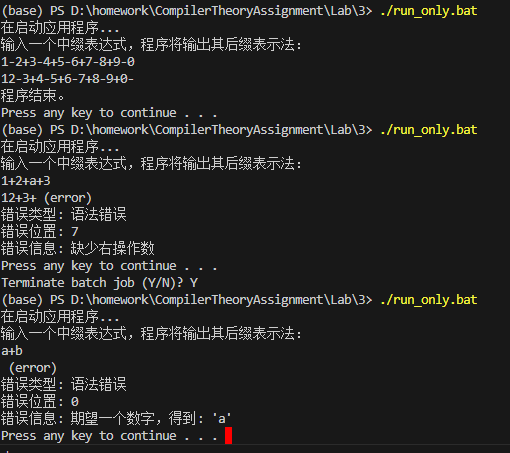
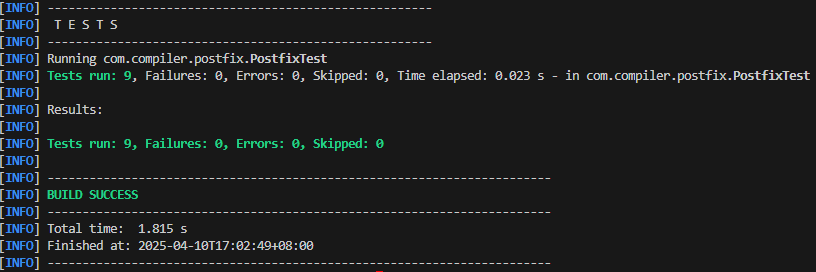
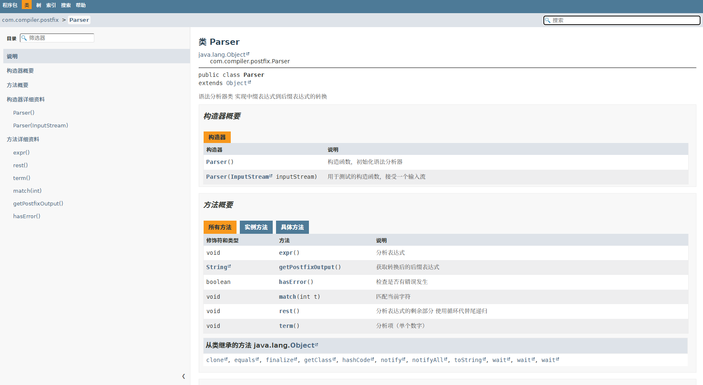

# 后缀表达式转换说明文档

- **姓名**：胡瑞康
- **学号**：22336087
- **邮箱**：hurk3@mail2.sysu.edu.cn
- **电话**: 13265249840

# 项目简介
这是一个将中缀表达式转换为后缀表达式的程序，使用Maven构建系统和JUnit进行单元测试。

# 技术栈

- **Java**: 版本 23.0.2
- **Maven**: 项目构建与依赖管理工具
- **JUnit 5**: 单元测试框架


# 运行方法

使用封装好的 `run.bat`文件进行编译和运行

```shell
./run.bat
```

如果您未安装maven，请直接运行下面的打包好的jar包

```
java -jar target/postfix-1.0-SNAPSHOT.jar
```

或者运行`./run_only.bat`

# 测试方法


## 人工简单测试

正确例子:
输入
```
1-2+3-4+5-6+7-8+9-0
```
输出
```
12-3+4-5+6-7+8-9+0-
```

错误例子：
输入
```
1+2+a+3
```
输出
```
12+3+ (error)
错误类型: 语法错误
错误位置: 7
错误信息: 缺少右操作数
```

输入
```
a+b
```
输出
```
 (error)
错误类型: 语法错误
错误位置: 0
错误信息: 期望一个数字，得到: 'a'
```



## 自动单元测试

使用以下命令运行单元测试：

```
mvn test
```

或者直接运行 `test.bat` 脚本。



# 文档生成

本次实验代码使用了 `javadoc` 生成文档，具体命令如下：

```shell
javadoc -d docs -sourcepath src/main/java -subpackages com.compiler
```

或者直接运行 `doc.bat` 脚本。

之后用浏览器端口对应文档可看到相关内容

