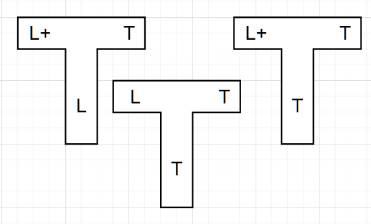

# 编译原理第一次作业

姓名:胡瑞康

学号:22336087

# 练习1.1

## 问题1
> $\circ$ Imagine an artificial computer language, which can be
utilized to solve a practical problem, i.e. the application
of the language.
Tips 1. Language is an alternative approach to problem
solving.
Tips 2. First find a proper problem, then design a
language to solve the problem.
$\circ$ 设想一种人工计算机语言，它可用于解决实际问题，即语言的应用。
提示1. 语言是解决问题的一种替代方法。
提示2. 首先找到一个合适的问题，然后设计一种语言来解决该问题。

### **问题背景**
HTML 是一种标记语言，虽然功能强大，但对于非技术人员来说，学习成本较高。我们需要设计一种更简单的语言，让用户能够通过直观的语法描述网页结构和内容。

### **解决的问题**
- 简化网页生成过程。
- 提供直观的语法规则，让非技术人员也能轻松上手。
- 自动生成标准的 HTML 页面。

### **语言名称**
将该语言命名为 **SimplePage Language (SPL)**。

### **核心特点**
1. **简化语法**：使用自然语言风格的语法，减少符号复杂度。
2. **模块化设计**：支持标题、段落、图片、链接等基本元素。
3. **自动布局**：默认提供简单的排版规则，用户无需关心样式细节。


## 问题2

> $\circ$ Give an example of a complete piece written in the
proposed language.
$\circ$ 给出一个用所提议语言编写的完整作品的示例。


以下是一个用 SPL 编写的简单网页示例：

```plaintext
page "我的网页"
    title "欢迎参观"
    section "介绍"
        paragraph "这是一个简单网页用SPL创建"
        image "example.jpg" caption "An example image"
    section "Links"
        link "百度" url "https://www.baidu.com"
        link "GitHub" url "https://www.github.com"
```

上述 SPL 代码会被编译为以下 HTML：

```html
<!DOCTYPE html>
<html>
<head>
    <title>欢迎参观</title>
</head>
<body>
    <h1>我的网页</h1>
    <section>
        <h2>介绍</h2>
        <p>这是一个简单网页用SPL创建</p>
        
    </section>
    <section>
        <h2>Links</h2>
        <a href="https://www.baidu.com">百度</a><br>
        <a href="https://www.github.com">GitHub</a>
    </section>
</body>
</html>
```

## 问题3
> $\circ$ Discuss how to define the new language and try your
approach.
$\circ$ 讨论如何定义新语言并尝试你的方法。


### **词法分析**
SPL 的词汇表包括以下几类：
1. **关键字**：`page`, `title`, `section`, `paragraph`, `image`, `link`
2. **标识符**：用户定义的字符串，如 `"我的网页"`
3. **分隔符**：空格、换行、缩进
4. **属性**：`url`, `caption`

### **语法规则**
SPL 的语法规则可以用上下文无关文法（CFG）表示：

```ebnf
Program     ::= PageDeclaration Section*
PageDeclaration ::= "page" String TitleDeclaration
TitleDeclaration ::= "title" String
Section     ::= "section" String Content*
Content     ::= Paragraph | Image | Link
Paragraph   ::= "paragraph" String
Image       ::= "image" String Caption?
Caption     ::= "caption" String
Link        ::= "link" String "url" String
String      ::= '"' [a-zA-Z0-9 ]+ '"'
```

### **语义规则**
1. 每个 `page` 必须有一个 `title`。
2. `section` 可以包含多个内容块（`paragraph`, `image`, `link`）。
3. `image` 可以选择性地带有 `caption`。


## 问题4
> $\circ$ Describe the process of changing the thinking of your language to a reality, i.e. how to make the artificial language usable.
$\circ$ 描述将你的语言思维转变为现实的过程，即如何使人工语言变得可用。


### **确定语言目标**
明确 SPL 的核心目标：
- 简化网页生成。
- 提供直观的语法规则，降低学习成本。
- 自动生成标准 HTML 页面。

### **定义语言规范**
- **词法分析**：定义 SPL 的词汇表，包括关键字、标识符、分隔符和属性。
- **语法规则**：使用上下文无关文法（CFG）定义 SPL 的语法规则。
- **语义规则**：定义 SPL 的语义约束，例如每个 `page` 必须有一个 `title`，`section` 可以包含多个内容块等。
-
### **设计编译器架构**
确定编译器的主要模块：
- **词法分析器**：将输入的 SPL 源代码分解为标记（tokens）。
- **语法分析器**：根据语法规则解析标记流，生成抽象语法树（AST）。
- **语义分析器**：检查 AST 是否符合语义规则。
- **代码生成器**：将 AST 转换为目标语言（HTML）。

# 练习1.2
> Draw a T - diagram with two stages of bootstrappings.
> - Given a new programming language $L++$, we firstly > implement $L$, a small subset of $L++$.
> - Then we use $L$ to implement $L+$, a subset of $L++$ and a > superset of $L$.
> - Finally, $L++$ is implemented using $L+$.
> 绘制一个具有两个自举阶段的T形图。
> - 给定一种新的编程语言 $L++$，我们首先实现 $L$，它是 $L++$ 的一> 个小子集。
> - 然后我们使用 $L$ 来实现 $L+$，它是 $L++$ 的一个子集且是 $L$ 的> 超集。
> - 最后，使用 $L+$ 来实现 $L++$。

假设`L++`的编译目标语言是`T`

先实现第一个用`T`语言实现的将`L`编译为`T`的编译器`C1`


基于`C1`实现`C2`，`C2`可以将`L+`编译为`T`



最后基于`C2`实现`C3`，`C3`可以将`L++`编译为`T`

