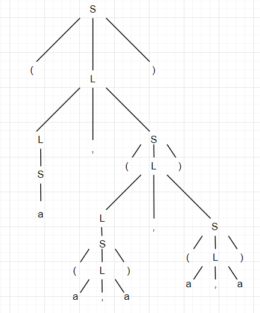
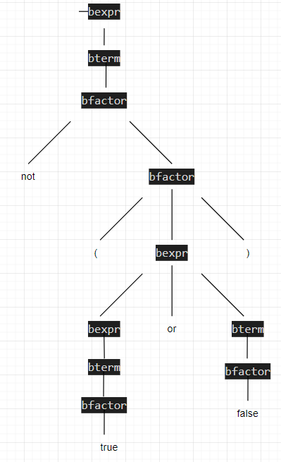

# 编译原理第2次作业

姓名:胡瑞康

学号:22336087

# Exercise 2.1

Given the following grammar:
$$
S\to(L)|a
$$
$$
L\to L,S|S
$$
Construct a parse tree for the sentence
$$
(a,((a,a),(a,a)))
$$

结果如下



---

# Exercise 2.2

Given the following grammar:
$$
bexpr \to bexpr\ or\ bterm|bterm
$$
$$
bterm \to bterm\ and\ bfactor|bfactor
$$
$$
bfactor \to not\ bfactor|(bexpr)|true|false
$$
Construct a parse tree for the sentence
$$
not(true\ or\ false)
$$

---

结果如下



---

# Exercise 2.3
$$
\begin{array}
{c}\mathrm{Is~the~grammar:} \\
\mathrm{S~\to~a~S~b~S~|~b~S~a~S~|~\varepsilon} \\
\text{ambiguous? Why?}
\end{array}
$$

该文法是**歧义文法**。原因在于，存在某些字符串可以有两种或更多不同的推导树（parse tree）。


文法产生式为
```
S → a S b S | b S a S | ε
```
每次使用产生式时，都会插入一对字母（一个 a 和一个 b），而内部的两个 S 可以独立推导出子串。

由于文法没有强制规定哪一个 a 必须与哪一个 b 配对，因此对于同一个字符串，可以根据推导时选择“先处理”或“后处理”某个子结构，从而得到不同的推导树。例如，对于某些非空字符串，可以先利用某一产生式构造出一对 a...b，再利用另一种顺序构造出另一对 a...b，导致同一个终结符串出现多种不同的分解方式。

换句话说，字符串的分解方式没有唯一性，因而产生了歧义。

具体例子：取字符串 **"abab"** 作为例子。给出两种不同的推导及其对应的语法树。

---


## 推导方式一

**推导过程：**

1. 从开始符号 $ S $ 出发，采用产生式
   $ S \to a\, S\, b\, S $
2. 对第一个 $ S $ 直接使用 $ S \to \varepsilon $，对第二个 $ S $ 再采用
   $ S \to a\, S\, b\, S $
3. 第二个 $ S $ 的两个子 $ S $ 均替换为 $ \varepsilon $

**推导过程的形式化描述：**

$$
\begin{array}{lcl}
S & \to & a\,S\,b\,S \\
  & \to & a\,\varepsilon\,b\,S \quad (\text{将第一个 } S \text{ 变为 } \varepsilon)\\[1mm]
  & \to & a\,\varepsilon\,b\,(a\,S\,b\,S) \quad (\text{对第二个 } S \text{ 用 } S \to a\,S\,b\,S)\\[1mm]
  & \to & a\,\varepsilon\,b\,(a\,\varepsilon\,b\,\varepsilon) \quad (\text{两个子 } S \text{ 均变为 } \varepsilon)\\[1mm]
  & = & abab
\end{array}
$$

**对应语法树：**

```
        S
      / | \  \
     a  S  b   S
        |      /|\ \
        ε     a S b S
                |   |
                ε   ε
```

---

## 推导方式二


1. 从开始符号 $ S $ 出发，仍采用产生式
   $ S \to a\,S\,b\,S $
2. 这次令右侧的 $ S $ 直接替换为 $ \varepsilon $，而对左侧的 $ S $ 采用另一条产生式
   $ S \to b\,S\,a\,S $
3. 在左侧产生式中，令两个 $ S $ 都替换为 $ \varepsilon $


$$
\begin{array}{lcl}
S & \to & a\,S\,b\,S \\
  & \to & a\,(b\,S\,a\,S)\,b\,S \quad (\text{对左侧 } S \text{ 用 } S \to b\,S\,a\,S,\ \text{右侧 } S \to \varepsilon)\\[1mm]
  & \to & a\,(b\,\varepsilon\,a\,\varepsilon)\,b\,\varepsilon \quad (\text{左侧产生式中两个 } S \text{ 均变为 } \varepsilon)\\[1mm]
  & = & abab
\end{array}
$$

**对应语法树：**

```
           S
         /  |       \   \
        a   S        b   S
           / | \  \      |
          b  S  a  S     ε
             |     |
             ε     ε
```
