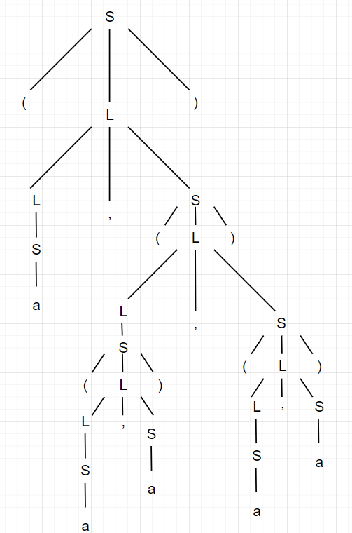
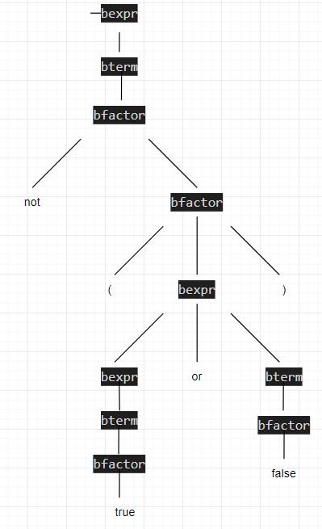

# 编译原理第2次作业

姓名:胡瑞康

学号:22336087

# Exercise 2.1

Given the following grammar:
$$
S\to(L)|a
$$
$$
L\to L,S|S
$$
Construct a parse tree for the sentence
$$
(a,((a,a),(a,a)))
$$

结果如下

---

# Exercise 2.2

Given the following grammar:
$$
bexpr \to bexpr\ or\ bterm|bterm
$$
$$
bterm \to bterm\ and\ bfactor|bfactor
$$
$$
bfactor \to not\ bfactor|(bexpr)|true|false
$$
Construct a parse tree for the sentence
$$
not(true\ or\ false)
$$

---

结果如下

