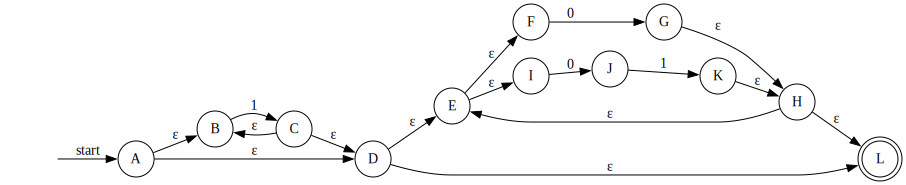
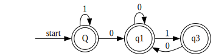

# 编译原理第3次作业

姓名:胡瑞康

学号:22336087

# Exercise 3.1

Give the recognized tokens of the following program in Pascal.

```pascal
function max(i, j: integer): integer;
{return the maximum of integers i and j}
begin
  if i > j then max := i else max := j
end;
```

(关键字, `function`)

(标识符, `max`)

(分隔符, `(`)

(标识符, `i`)

(分隔符, `,`)

(标识符, `j`)

(分隔符, `:`)

(标识符, `integer`)

(分隔符, `)`)

(分隔符, `:`)

(标识符, `integer`)

(分隔符, `;`)

(注释, `{return the maximum of integers i and j}`)

(关键字, `begin`)

(关键字, `if`)

(标识符, `i`)

(运算符, `>`)

(标识符, `j`)

(关键字, `then`)

(标识符, `max`)

(运算符, `:=`)

(标识符, `i`)

(关键字, `else`)

(标识符, `max`)

(运算符, `:=`)

(标识符, `j`)

(关键字, `end`)

(分隔符, `;`)

# Exercise 3.2

### 题目

(DBv2, Ch.3, pp.125, ex.3.3.2) Describe the languages denoted by the following regular expressions:
- `a (a | b)* a`
- `a* b a* b a* b a*`

---

**正则表达式** `a (a | b)* a`

该正则表达式表示所有以字母 **a** 开头并以字母 **a** 结尾，中间部分由任意个（包括 0 个）字母 **a** 或 **b** 的字符串。

例如：`aa`、`aba`、`abba`、`aabbaa` 等。

---

**正则表达式** `a* b a* b a* b a*`

该正则表达式描述的语言是所有只由字母 **a** 和 **b** 构成且恰好包含三个 **b** 的字符串。
具体来看：
- `a*` 表示任意个（包括 0 个）字母 **a**；
- 中间的 `b` 是固定的；
- 总共有三个 `b` 分别被不同的 `a*` 包围。

也就是说，该语言中的任一字符串都可以分解为：

任意个 **a** + 第一个 **b** + 任意个 **a** + 第二个 **b** + 任意个 **a** + 第三个 **b** + 任意个 **a**。

例如：`bbb`、`ababb`、`aabababa` 等。

# Exercise 3.3

(DBv2, Ch.3, pp.125, ex.3.3.4)
Most languages are case sensitive, so keywords can be written only one way, and the regular expressions describing their lexemes are very simple.

However, some languages, like Pascal and SQL, are case insensitive. For example, the SQL keyword `SELECT` can also be written `select`, `Select`, `Or sELEcT`.

Show how to write a regular expression for a keyword in a case insensitive language. Illustrate your idea by writing the expression for `SELECT` in SQL.

---

在不借助正则表达式引擎的内置选项（如 `(?i)`）的情况下，可以通过为每个字母提供一个字符集来匹配其大写和小写形式。

例如，对于 SQL 中的关键字 `SELECT`，可以写成如下正则表达式：

```
[sS][eE][lL][eE][cC][tT]
```

该表达式的含义是：
- `[sS]` 匹配字符 `s` 或 `S`
- `[eE]` 匹配字符 `e` 或 `E`
- `[lL]` 匹配字符 `l` 或 `L`
- `[eE]` 匹配字符 `e` 或 `E`
- `[cC]` 匹配字符 `c` 或 `C`
- `[tT]` 匹配字符 `t` 或 `T`

这样，无论 `SELECT` 是以什么大小写组合出现，这个正则表达式都可以正确匹配。

# Exercise 3.4

Given the following regular expression `1*(0 | 01)*`

---

## (1) Transform it to an equivalent finite automaton.

- **q0**为起始状态且接受所有由`1*`生成的字符串，通过自环接受任意个`1`；
- **q0**通过ε转换进入**q1**，**q1**同为接受状态，表示(0|01)*部分可为空；
- **q1**分出两条转换：直接读取`0`到达**q3**，或读取`0`后进入中间状态**q2**，再读取`1`到达**q3**；
- **q3**通过ε转换回到**q1**，构成(0|01)*的闭包。




---

## (2) Construct an equivalent DFA for the result of exercise (1).

| DFA状态 | 对应NFA状态集合  | 输入0后的状态 | 输入1后的状态 | 是否接受状态  |
|---------|-----------------|---------------|---------------|---------------|
| A       | {q0, q1}       | B = {q1, q2, q3} | A = {q0, q1} | 是            |
| B       | {q1, q2, q3}   | B = {q1, q2, q3} | C = {q1, q3} | 是            |
| C       | {q1, q3}       | B = {q1, q2, q3} | D = ∅       | 是            |
| D       | ∅              | D = ∅         | D = ∅         | 否            |


---

## (3) Reduce the result of (2) and get a reduced DFA.

删掉了状态D，其余不变



# Exercise 3.5

Given the alphabet Σ = { z, o, / }, a comment in a program over Σ begins with "/o" and ends with "o/". Embedded comments are not permitted.
(1) Draw a DFA that recognizes nothing but all the comments in the source programs.
(2) Write a single regular expression that exactly describes all the comments in the source programs.

给定字母表 Σ = { z, o, / }，程序中以 Σ 为字符集的注释以 "/o" 开头，以 "o/" 结尾。不允许有嵌套注释。
(1) 画出一个确定有限自动机（DFA），它只识别源程序中的所有注释。
(2) 写出一个正则表达式，精确描述源程序中的所有注释。


## DFA

状态定义：
- **q₀**：初始状态，期待注释的开始。
- **q₁**：已经看到 "/"，期待 "o" 以开始注释。
- **q₂**：进入注释内部，最后一个字符不是 "o"。
- **q₃**：进入注释内部，最后一个字符是 "o"（需要检查下一个字符是否为 "/"）。
- **q₄**：已经看到 "o/"，如果字符串在这里结束则接受。
- **q_dead**：死状态，表示字符串无效。

状态转移规则：
- **从 q₀（初始状态）**：
  - 输入 / → q₁（注释可能开始）
  - 输入 z, o → q_dead（必须以 "/" 开头）
- **从 q₁（看到 "/"）**：
  - 输入 o → q₂（"/o" 完成，进入注释）
  - 输入 z, / → q_dead（"/z" 或 "//" 无效）
- **从 q₂（注释内部，非 "o" 结尾）**：
  - 输入 z → q₂（继续）
  - 输入 / → q₂（继续）
  - 输入 o → q₃（记录 "o"，检查下一个字符）
- **从 q₃（注释内部，以 "o" 结尾）**：
  - 输入 z → q₂（"o z" 合法）
  - 输入 o → q₃（"o o" 合法，继续观察）
  - 输入 / → q₄（"o/" 出现，可能结束）
- **从 q₄（看到 "o/"）**：
  - 输入 z, o, / → q_dead（"o/" 后不能有字符）
- **从 q_dead（死状态）**：
  - 输入 z, o, / → q_dead（保持无效）

- **初始状态**：q₀
- **接受状态**：q₄（表示完整注释结束）

图片：


## 编写正则表达式

`/o((z|/)*(o(z|o)*))*o/`

(z | /)*: 表示0或者多个`z`或者`/`

(o (z | o)*): 一个`o`后面跟着零个或多个`z`或`o`字符。

两个组合起来，允许任意数量的此类块。


使用程序验证
```python
import re

pattern = r'^/o((z|/)*(o(z|o)*))*o/$'

# 测试函数，使用 re.fullmatch 来确保整个字符串都被匹配
def test_comment(comment):
    match = re.fullmatch(pattern, comment)
    if match:
        print(f"'{comment}' 匹配成功！")
        print(f"匹配位置：开始={match.start()}, 结束={match.end()}")
        print(f"匹配字符串：{match.group(0)}")
        print(f"匹配组：{match.groups()}")
    else:
        print(f"'{comment}' 匹配失败。")

# 示例测试用例
test_cases = [
    "/oo/",         # 简单注释
    "/ozoo/",       # 包含 z
    "/oz/zoo/",     # 包含 z/...
    "/o/",          # 不合法注释
    "/ozo/z/",      # 不合法的注释
]

for tc in test_cases:
    test_comment(tc)
```

结果
```shell
'/oo/' 匹配成功！
匹配位置：开始=0, 结束=4
匹配字符串：/oo/
匹配组：(None, None, None, None)
'/ozoo/' 匹配成功！
匹配位置：开始=0, 结束=6
匹配字符串：/ozoo/
匹配组：('zo', 'z', 'o', None)
'/oz/zoo/' 匹配成功！
匹配位置：开始=0, 结束=8
匹配字符串：/oz/zoo/
匹配组：('z/zo', 'z', 'o', None)
'/o/' 匹配失败。
'/ozo/z/' 匹配失败。
```

符合预期