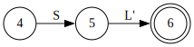

# 编译原理第4次作业

姓名:胡瑞康

学号:22336087

# Exercise 4.1

Given the following grammar
$$
S\to(L)|a
$$
$$
L\to L,S|S
$$
- Eliminate left recursions in the grammar.
- Draw the transition diagrams for the grammar
- Write a recursive descent predictive parser.
- Indicate the procedure call sequence for an input sentence$(a,(a,a))$.

## 消除左递归


原始文法为
$$
\begin{aligned}
S &\to (L) \;|\; a\\[1mm]
L &\to L,\,S \;|\; S
\end{aligned}
$$
其中产生式$L\to L,\,S$含有直接左递归。

利用消除左递归的标准方法，对于形如
$$
A\to A\alpha \;|\; \beta
$$
可改写为
$$
\begin{aligned}
A &\to \beta A'\\[1mm]
A' &\to \alpha A' \;|\; \epsilon
\end{aligned}
$$
因此令$A = L$、$\beta = S$且$\alpha = ,\,S$，得到消除左递归后的文法：

$$
\begin{aligned}
S &\to (L) \;|\; a\\[1mm]
L &\to S\,L'\\[1mm]
L' &\to ,\,S\,L' \;|\; \epsilon
\end{aligned}
$$

## 绘制状态图

$S \to (L) \;|\; a$


$L \to S L'$



$L' \to , S L' \;|\; \epsilon\$


## Parser伪代码

```c
void S() {
    // S → ( L ) | a
    if (lookahead == '(') {
        match('(');
        L();
        match(')');
    } else if (lookahead == 'a') {
        match('a');
    } else {
        error();
    }
}
void L() {
    // L → S L'
    S();
    LPrime();
}
void LPrime() {
    // L' → , S L' | ε
    if (lookahead == ',') {
        match(',');
        S();
        LPrime();
    }
    // 如果不是逗号，直接 ε 返回
}
void match(char tok) {
    if (lookahead == tok) {
        lookahead = scanner.getNextToken();
    } else {
        error();
    }
}
```

## 调用序列

输入：$(a,(a,a))$，
token序列为：`(`, `a`, `,`, `(`, `a`, `,`, `a`, `)`, `)`。

模拟过程：
1. **S()**
   - 前看 = '('，执行：`match('(')` →$L$→ `match(')')`
   - 下一token：'a'

2. **L()**
   - 调用 `S()` → `LPrime()`

3. **S()**（嵌套）
   - 前看 = 'a'，执行：`match('a')`
   - 下一token：','

4. **LPrime()**
   - 前看 = ','，执行：`match(',')` → `S()` → `LPrime()`
   - 下一token：'('

5. **S()**（嵌套）
   - 前看 = '('，执行：`match('(')` →$L$→ `match(')')`
   - 下一token：'a'

6. **L()**（嵌套）
   - 调用 `S()` → `LPrime()`

7. **S()**（嵌套）
   - 前看 = 'a'，执行：`match('a')`
   - 下一token：','

8. **LPrime()**（嵌套）
   - 前看 = ','，执行：`match(',')` → `S()` → `LPrime()`
   - 下一token：'a'

9. **S()**（嵌套）
   - 前看 = 'a'，执行：`match('a')`
   - 下一token：')'

10. **LPrime()**（嵌套）
    - 前看 = ')'，不是 ','，执行$\epsilon$（无动作，返回）

11. **回到 S()**，完成 `match(')')`
    - 下一token：')'

12. **回到 LPrime()**
    - 前看 = ')'，不是 ','，执行$\epsilon$（返回）

13. **回到 S()**，完成 `match(')')`
    - 输入结束

调用序列：
- `S()`
  - `match('(')`
  - `L()`
    - `S()`
      - `match('a')`
    - `LPrime()`
      - `match(',')`
      - `S()`
        - `match('(')`
        - `L()`
          - `S()`
            - `match('a')`
          - `LPrime()`
            - `match(',')`
            - `S()`
              - `match('a')`
            - `LPrime()` (ε)
        - `match(')')`
      - `LPrime()` (ε)
  - `match(')')`


# Exercise 4.2
Consider the context-free grammar
$$
S\to aSbS|bSaS|\varepsilon
$$
Can you construct a predictive parser for the grammar? and why?


计算每个产生式的FIRST集合：

$\text{FIRST}(aSbS) = \{a\}$

$\text{FIRST}(bSaS) = \{b\}$

$\text{FIRST}(\varepsilon) = \{\varepsilon\}$

三个产生式的FIRST集合互不相交，初步满足LL(1)的条件。

计算非终结符$S$的FOLLOW集合：$S$是开始符号，故FOLLOW(S)初始包含结束符$\$$。
- 对于产生式$S \to aSbS$：
  - 第一个$S$后紧跟$b$，故将$b$加入FOLLOW(S)。
  - 第二个$S$位于末尾，需将FOLLOW(S)自身加入（即包含$\$, a, b$）。
- 对于产生式$S \to bSaS$：
  - 第一个$S$后紧跟$a$，故将$a$加入FOLLOW(S)。
  - 第二个$S$位于末尾，同样需将FOLLOW(S)自身加入。

最终，$\text{FOLLOW}(S) = \{a, b, \$\}$。

对于产生式$S \to \varepsilon$：

当$S$推导出$\varepsilon$时，需检查输入符号是否属于FOLLOW(S)。

但FOLLOW(S) =$\{a, b, \$\}$，而其他产生式的FIRST集合为$\{a\}, \{b\}$，出现了交集。

**冲突点**：当输入符号为$a$或$b$时，既可选择对应产生式（如$aSbS$或$bSaS$），也可因输入符号属于FOLLOW(S)而选择$\varepsilon$。这导致同一输入符号对应多个产生式，无法唯一确定推导路径。


由于FOLLOW(S)与非空产生式的FIRST集合存在交集，该文法不满足LL(1)条件，**无法构造预测分析器**。


# Exercise 4.3


Compute the FIRST and FOLLOW for the start symbol of the following grammar
$$
S\to S S +|S S *|a
$$


求 FIRST 集合

对于非终结符$S$：
- 考察产生式$S \to a$：显然$\text{FIRST}(a)=\{a\}$。
- 对于产生式$S \to S\,S\,+$和$S \to S\,S\,*$，由于这两条产生式都是左递归，最终都必须从$S$推导出终结符。由于唯一给出终结符的产生式是$S \to a$，因此无论如何推导，导出的串一定以$a$开头。

所以有：
$$
\text{FIRST}(S)=\{a\}.
$$

求 FOLLOW 集合

由于$S$是文法的开始符号，所以$\$$必在$\text{FOLLOW}(S)$中，即：
$$
\$\in \text{FOLLOW}(S).
$$

现在，分析各产生式中$S$出现后的符号：

在产生式$S \to S\,S\,+$中：
- 第一个$S$后面紧跟非终结符$S$，而$\text{FIRST}(S)=\{a\}$，故：
 $$
  a \in \text{FOLLOW}(S).
 $$
- 第二个$S$后面紧跟终结符$+$，故：
 $$
  + \in \text{FOLLOW}(S).
 $$

在产生式$S \to S\,S\,*$中：
- 第一个$S$后面紧跟$S$，同样有：
 $$
  a \in \text{FOLLOW}(S).
 $$
- 第二个$S$后面紧跟终结符$*$，故：
 $$
  * \in \text{FOLLOW}(S).
 $$

综上，$\text{FOLLOW}(S)$为：
$$
\text{FOLLOW}(S)=\{a,\,+,\,*,\,\$\}.
$$