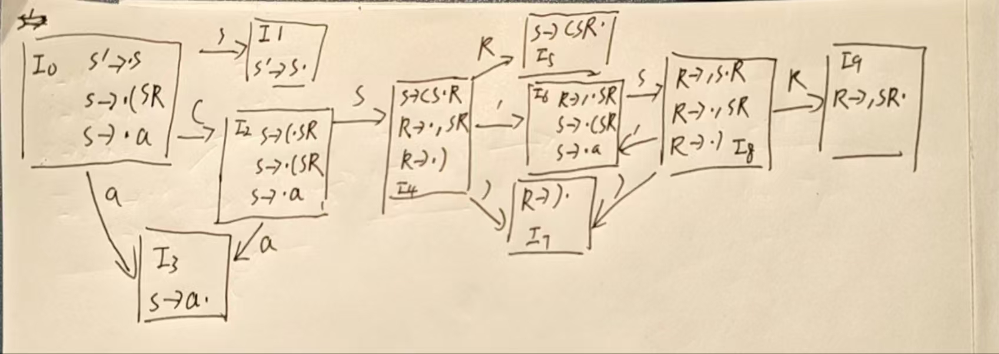

# 编译原理第6次作业

姓名:胡瑞康

学号:22336087

# Exercise 7.1

Consider the grammar
S → ( SR | a
R → , SR | )
Try to construct an SLR(1) parsing table for the grammar, and see if there are conflicts in the parsing table.

---

先写增广文法
0. $ S' \rightarrow S $
1. $ S \rightarrow ( S R $
2. $ S \rightarrow a $
3. $ R \rightarrow , S R $
4. $ R \rightarrow ) $

完成DFA

计算FIRST集

FIRST(S) = { (, a }

FIRST(R) = { ,, ) }

计算FOLLOW集

FOLLOW(S) = { $ , , , ) }

FOLLOW(R) = { $, , , ) }

构建SLR(1)表

| 状态 | ACTION         |        |        |        | GOTO      |
|------|----------------|--------|--------|--------|-----------|
|      | (          | a  | ,  | )  | $     | S | R |
| 0    | s2             | s3     |        |        |           | 1     |       |
| 1    |                |        |        |        | accept    |       |       |
| 2    | s2             | s3     |        |        |           | 4     |       |
| 3    | r2 (S→a)       |        | r2     | r2     | r2        |       |       |
| 4    |                |        | s6     | s7     |           |       | 5     |
| 5    | r1 (S→(SR))    |        | r1     | r1     | r1        |       |       |
| 6    | s2             | s3     |        |        |           | 8     |       |
| 7    | r4 (R→))       |        | r4     | r4     | r4        |       |       |
| 8    |                |        | s6     | s7     |           |       | 9     |
| 9    | r3 (R→,SR))    |        | r3     | r3     | r3        |       |       |

---

# Exercise 7.2
Consider the grammar
  - S → S a b | a R
  - R → S | a
  - 该文法是SLR(1)文法吗？为什么？

写增广文法

0. S' → S
1. S → S a b
2. S → a R
3. R → S
4. R → a

完成DFA

求First集

- FIRST(S)：
  - 由产生式 S → a R，可以确定 a ∈ FIRST(S)；
  - 产生式 S → S a b 虽然是左递归，但 S 推导出的终结符也必然以 a 开始（因为只有另一产生式 S → a R 可用），所以 FIRST(S) = { a }。

- FIRST(R)：
  - 由 R → S 可得 FIRST(S) ⊆ FIRST(R)，即 a ∈ FIRST(R)；
  - 再由 R → a 得 a ∈ FIRST(R)，
  故 FIRST(R) = { a }。

求Follow集

- FOLLOW(S)：
  - S 是开始符号，所以 $ ∈ FOLLOW(S)；
  - 在产生式 S → S a b 中，S 后面紧跟 a，所以 a ∈ FOLLOW(S)；
  - 而在 R → S 中，由于 S 完全替换了 R，按照规则有 FOLLOW(S) ⊆ FOLLOW(R)。

- FOLLOW(R)：
  - 在产生式 S → a R 中，R 处于产生式右端，所以有 FOLLOW(R) ⊇ FOLLOW(S)。

可得： FOLLOW(S) = FOLLOW(R) = { a, $ }

寻找冲突

I₄ = { R → S., S → S. a b }
  * 规约项目 R → S. ，对应的 FOLLOW(R) = {$, a}. 动作：在 $ 或 a 上规约。
  * 移进项目 S → S. a b ，对应的下一个符号是 'a'. 动作：在 'a' 上移进。
  * 冲突！ 当下一个输入符号是 'a' 时：
      * 根据 R → S. 和 a ∈ FOLLOW(R)，可以执行规约操作。
      * 根据 S → S. a b，可以执行移进操作。
  * 存在 移进/规约冲突。

I₅ = { R → a., S → a. R, R → .S, R → .a, S → .S a b, S → .a R }
  * 规约项目 R → a. ，对应的 FOLLOW(R) = {$, a}. 动作：在 $ 或 a 上规约。
  * 存在移进项 R → .a 和 S → .a R，导致在 'a' 上可以移进（回到 I₅）。
  * 冲突！ 当下一个输入符号是 'a' 时：
      * 根据 R → a. 和 a ∈ FOLLOW(R)，可以执行规约操作。
      * 根据 R → .a 或 S → .a R，可以执行移进操作。
  * 存在 移进/规约冲突。

因为在项目集 I₄ 和 I₅ 中，当面临输入符号 'a' 时，都存在移进/规约冲突，所以该文法 不是 SLR(1) 文法。

---

# Exercise 7.3
Consider the grammar
  - S → A
  - A → BA | ε
  - B → a B | b
  - 证明该文法是LR(1)文法。
  - 为该文法构造LR(1)分析表。
  - 按照本讲幻灯片中的格式，展示对句子abab的详细分析过程。

## 证明文法是LR(1)文法

增广文法：

S′ → S

S → A

A → B A | ε

B → a B | b

---

求 FIRST 集

由 B → aB | b，有  FIRST(B) = { a, b }。

由 A → BA | ε，其中 B 的 FIRST 集是 { a, b }，且右侧 A 还可能推导出 ε（因为 A → ε），故  FIRST(A) = FIRST(B) ∪ { ε } = { a, b, ε }。

---

求 FOLLOW 集

由于 S′ → S，故 FOLLOW(S) ⊇ { \$ }。

S → A，所以 FOLLOW(A) ⊇ FOLLOW(S) = { \$ }。

在 A → B A 中，考虑非终结符 B 与 A 的关系：
  - 对于 B，后面紧跟 A，所以其 FOLLOW 集应包含 FIRST(A) 中除了 ε 的部分，即 { a, b }。
  - 又因为 A 能推导出 ε，所以还要把 FOLLOW(A) 加入 B 的 FOLLOW 集。因此
    FOLLOW(B) = { a, b } ∪ FOLLOW(A) = { a, b, \$ }。

A 在 A → BA 的右侧，其 FOLLOW 集与 A 在左侧相同，所以
  FOLLOW(A) = { \$ }。

---

构造 LR(1) 项集族

I₀: 包含规约项 [A → ., \$] 和移进项 [B → .a B, a/b/\$], [B → .b, a/b/\$]。
规约 A → ε 的向前看符号是 { \$ }。
移进 a 的符号是 { a }。
移进 b 的符号是 { b }。
向前看符号集合 { \$ }, { a }, { b } 两两不相交。无冲突。

I₁: 接受状态。无冲突。

I₂: 规约状态。无冲突。

I₃: 包含规约项 [A → ., \$] 和移进项 [B → .a B, a/b/\$], [B → .b, a/b/\$]。
规约 A → ε 的向前看符号是 { \$ }。
移进 a 的符号是 { a }。
移进 b 的符号是 { b }。
向前看符号集合 { \$ }, { a }, { b } 两两不相交。无冲突。

I₄: 只有移进项。无冲突。

I₅: 规约状态 [B → b ., a/b/\$]。规约 B → b 的向前看符号是 { a, b, \$ }。无冲突。

I₆: 规约状态 [A → B A ., \$]。规约 A → BA 的向前看符号是 { \$ }。无冲突。

I₇: 规约状态 [B → a B ., a/b/\$]。规约 B → aB 的向前看符号是 { a, b, \$ }。无冲突。

因此 该文法是 LR(1) 文法。

## 构造分析表

 编号：S′ → S 为 0，S → A 为 1，A → BA 为 2，A → ε 为 3，B → aB 为 4，B → b 为 5

| 状态 | Action 表 |  |  |  | Goto 表 |  |  |
| ---- | ---- | ---- | ---- | ---- | ---- | ---- | ---- |
|  | `a` | `b` | `$` |  | `S` | `A` | `B` |
| 0 | `s4` | `s5` |  |  | 1 | 2 | 3 |
| 1 |  |  | `acc` |  |  |  |  |
| 2 |  |  | `r2` |  |  |  |  |
| 3 | `s4` | `s5` | `r2` |  |  |  |  |
| 4 | `s4` | `s5` |  |  |  |  | 7 |
| 5 | `r3` | `r3` | `r3` |  |  |  |  |
| 6 |  |  | `r1` |  |  |  |  |
| 7 | `r4` | `r4` | `r4` |  |  |  |  |

### 对句子 `abab` 的详细分析过程

| 步骤 | 栈 | 输入 | 动作 |
| ---- | ---- | ---- | ---- |
| 1 | 0 | `abab$` | 移进，状态 4 |
| 2 | 04 | `bab$` | 移进，状态 5 |
| 3 | 045 | `ab$` | 按 `B → b` 规约，状态 7 |
| 4 | 047 | `ab$` | 移进，状态 4 |
| 5 | 0474 | `b$` | 移进，状态 5 |
| 6 | 04745 | `$` | 按 `B → b` 规约，状态 7 |
| 7 | 04747 | `$` | 按 `B → aB` 规约，状态 3 |
| 8 | 0473 | `$` | 按 `A → BA` 规约，状态 2 |
| 9 | 02 | `$` | 按 `S → A` 规约，状态 1 |
| 10 | 01 | `$` | 接受 |

# Exercise 7.4
证明如下文法
  - S → A a | b A c | d c | b d a
  - A → d

是LALR(1)文法，但不是SLR(1)文法。

---

A → d，所以FIRST(A) = {d}。

---

对于非终结符 A，由产生式出现位置可知：

- 在 S → A a 中，A 后面跟终结符 a，因此 a ∈ FOLLOW(A)；
- 在 S → b A c 中，A 后面跟终结符 c，因此 c ∈ FOLLOW(A)。

因此有  FOLLOW(A) = {a, c}。

---

构造 LR(0) 项集（局部描述）

构造增广文法后（记为 S′ → S），初始项目集 I₀ 包含

- S′ → ·S
- S → ·A a  |  ·b A c  |  ·d c  |  ·b d a
- 由于 S → ·A a 中“·”后为 A，故应用闭包，将 A 的产生式加入：A → ·d

---

可以看出，在 I₀ 中既出现了项目 **S → ·d c** 又出现了项目 **A → ·d**。当遇到终结符 d 时，二者都会移进生成带点项，例如：

- 从 S → ·d c：读 d 得到 **S → d · c**
- 从 A → ·d：读 d 得到 **A → d ·**（归约项）

而在 SLR(1) 分析中，对项目 **A → d ·** 采取归约动作时，归约操作适用于所有在 FOLLOW(A) 中的终结符，即同时在 a 和 c 上归约。但注意，在状态中同时会出现 **S → d · c**，当下一个输入符号为 c 时，该项目要求移进（等待读入 c），而归约动作也因 c ∈ FOLLOW(A) 而被触发，从而产生**移进–归约冲突**。

在 SLR(1) 分析表中，对于终结符 c 存在冲突，所以文法不是 SLR(1) 的。

---

LR(1) / LALR(1) 分析